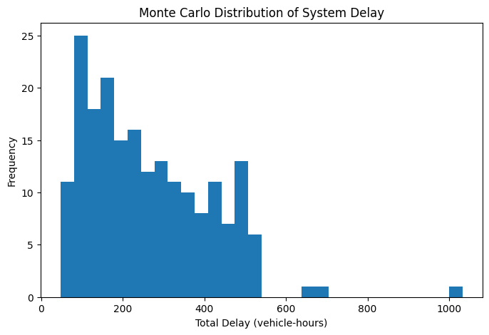
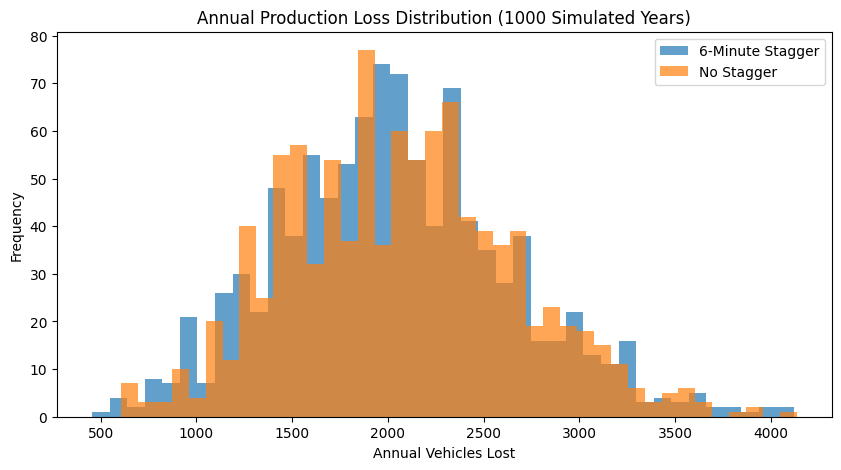
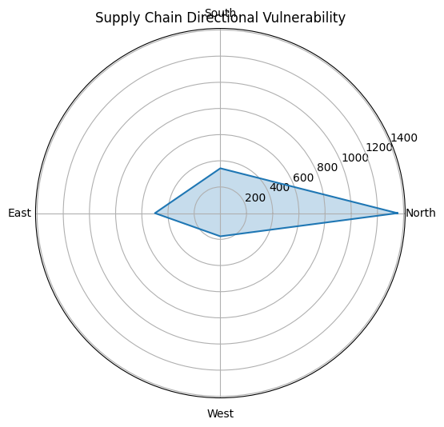
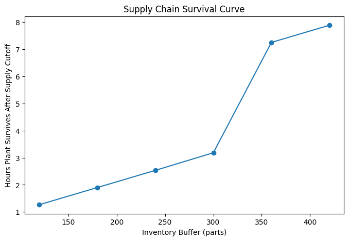
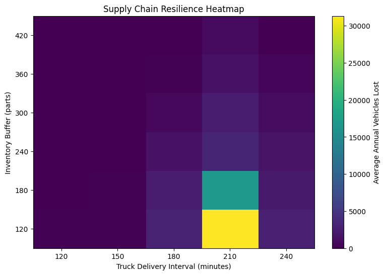

My name is Tyler "Slade" Gilmer, and I am a graduate student at the University of Alabama in Huntsville, majoring in Industrial and Systems Engineering.

I design and build data-driven decision systems for complex, disruption-prone environments, focusing on manufacturing systems and infrastructure networks.

My work combines simulation, machine learning, and systems modeling to improve resilience, efficiency, and operational decision-making.

---

## Featured Projects

# American Heartland Rail System

## 📄 Final Paper

(American%20Heartland%20Rail%20Final.pdf)

## 📊 Overview

This project presents a phased, economically viable intercity rail network for the U.S. Midwest and South. The model evaluates ridership, revenue, and benefit-cost ratios across multiple corridor configurations using simulation and economic analysis.

## 🔧 Methods

* Network modeling (Python / NetworkX)
* Gravity-based demand modeling
* Monte Carlo simulation
* Cost-benefit and BCR analysis

## 📈 Key Results

* Strong BCR (>2.0 in base case)
* Robust performance across sensitivity scenarios
* Identified high-impact corridors (Chicago–Nashville, Texas Triangle, etc.)

## 🗺️ Figures

---

# Urban Traffic Flow & Resilience Model (Huntsville Case Study)

## Overview
This project develops a network-based traffic simulation model to analyze congestion propagation, system resilience, and infrastructure vulnerability in Huntsville, Alabama.

The model evaluates how disruptions, demand variability, and time-of-day patterns impact system performance, with a focus on identifying critical bottlenecks and effective mitigation strategies.

---

## Key Features

- Directed network model of urban traffic corridors
- Volume-delay congestion modeling (BPR function)
- Monte Carlo simulation for stochastic demand and incidents
- Time-of-day demand modeling (AM Peak, PM Peak, Midday, Night)
- Scenario analysis (baseline, incident, and targeted improvement)
- Visualization of network congestion and system performance

---

## Key Results

- Disruption of a critical corridor (I-565) increased total system delay by **+1851%**
- Monte Carlo simulation revealed a **low-frequency, high-impact failure system (~6% probability)**
- Targeted improvements to alternate corridors restored system performance to baseline levels
- AM Peak produced the highest congestion, indicating vulnerability due to concentrated inbound demand

---

## Methodology

- Graph-based traffic network (nodes = zones, edges = corridors)
- Shortest-path traffic assignment with iterative updates
- Nonlinear congestion modeled using volume-delay functions
- Stochastic simulation with random incidents and demand variability

---

## Visualizations

### Baseline Network

### Incident Scenario

### Monte Carlo Delay Distribution

### Time-of-Day Analysis

---

## Tools & Technologies

- Python
- NumPy, Pandas
- NetworkX
- Matplotlib
- Monte Carlo Simulation

---

## Report

Full analysis available here:

[Traffic Flow & Resilience Report](HSV%20Traffic%20Model%20Report.pdf)

# Reinforcement Learning for JIT Manufacturing Optimization (RL -vs- Reactive)
A reinforcement learning-based decision system that reduces shortages and overtime in JIT manufacturing, improving both reliability and cost efficiency under uncertainty.

### Impact:
- ↓ Shortages by ~17%
- ↓ Overtime by ~19%
- ~$2,280 annual cost savings
  
## Overview

This project develops a reinforcement learning (RL)-based decision support system for a simulated Just-in-Time (JIT) manufacturing environment under stochastic disruptions.

The goal is to improve operational decision-making by reducing:
- Production shortages
- Unnecessary overtime
- Overall system cost

A Q-learning agent is trained to replace a traditional threshold-based reactive policy.

---

## Problem Context

JIT manufacturing systems minimize inventory but are highly sensitive to disruptions. Traditional control policies rely on fixed inventory thresholds, which are reactive and do not account for uncertainty or system dynamics.

This project explores whether RL can provide a more adaptive and efficient control strategy.

---

## Methodology

- Simulation of a dual-shift manufacturing system
- Stochastic demand and supply disruptions
- Q-learning reinforcement learning agent
- 500 training episodes
- 50 independent evaluation runs (Monte Carlo simulation)

### Actions:
- 0 → Do nothing
- 1 → Call overtime

#Results

## Key Insight

Unlike traditional threshold-based policies, the RL agent learns system context (inventory levels and disruption states) and selectively applies overtime only when it is truly beneficial.

This results in a dominant decision strategy—simultaneously improving shortage reduction and cost efficiency without the typical tradeoff between reliability and operational cost.

## Tech Stack

- Python
- NumPy
- Matplotlib
- Reinforcement Learning (Q-Learning)
- Jupyter / Google Colab

## Full Report

[View Full Project Report](RL%20v%20Reactive%20Report.pdf)

### TVA Grid Cascading Failure Simulation
Network model of the Tennessee Valley Authority power grid analyzing cascading failure propagation and systemic blackout risk.

Tech used:
Python, NetworkX, Monte Carlo simulation, Matplotlib

Key outcomes:
• Identified critical grid nodes that amplify cascading failures  
• Modeled blackout probability across transmission corridors

---
### Cascade Participation Heatmap

---
### Transmission Network Map

---
### Blackout Probability Map

---
### Critical Trigger Locations

## Full Report

[View Full Project Report](TVA%20Cascade%20Report.pdf).

---
### Predictive Parts Shortage Risk Modeling in JIT Manufacturing
Machine learning model predicting parts shortages in a just-in-time production system with closed-loop operational decision control.

Tech used:
Python, Scikit-learn, Random Forest, Monte Carlo simulation

Key outcomes:
• Reduced simulated shortage occurrence  
• Evaluated operational tradeoffs between overtime and inventory stability

---
**Inventory Trajectory with Closed Loop**

---
**Inventory Trajectory Human vs ML**

---
**Distribution of OT over Simulations**

---
**Distribution of Shortage Risk Reduction (Human vs ML Policy)**

## Full Report

[View Full Project Report](ISE%20726%20Final%20Project.pdf)

---

### Weather-Driven JIT Supply Chain Disruption Model
Simulation of how regional weather events propagate through supplier networks to impact manufacturing production schedules.

Tech used:
Python, stochastic simulation, inventory modeling

Key outcomes:
• Modeled supply disruption risk  
• Evaluated production resilience strategies

---
**Weather Figure Loss Distribution**

---
**Weather Corridor Vulnerability**

---
**Severe Weather Supply Chain Survivability Curve**

---
**Inventory Buffer Heatmap**

## Full Report

[View Full Project Report](JIT%20Weather%20Report.pdf)

---

## Technical Skills

Languages
Python, SQL

Libraries / Tools
NetworkX, NumPy, Pandas, Scikit-learn, Matplotlib

Methods
Monte Carlo simulation
Machine learning
Systems modeling
Network analysis

I also have certification in FANUC Robotics during my time as a robot doctor at Mazda Toyota Manufacturing, as well as hands-on experience with the robots, including building applicators, helping install lines, as well as work with PELT machines for paint film builds, wave scan meters, and color meters. 

## Contact

I’m actively seeking opportunities in systems engineering, manufacturing engineering, or data-driven operations roles. My phone number is (256)627-7162 and my email is gilmer72086@yahoo.com
